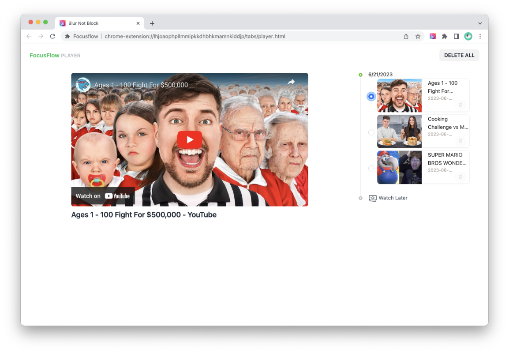

# Blur Not Block (Chrome Extension)

Let's make the Internet less interesting so that we can focus on what matters. A simple browser extension that helps you defer your urge to open distracting websites such as YouTube.

  

## Blur Not Block - Key for productivity

Blur not Block! FocusFlow makes the Internet less interesting by blurring images on your favorite social media website such as YouTube and let you defer content consumption for later. So that  we can focus on what matters most.

  

The extension will convert the images on the page to grayscale and blur them. So that web site such as YouTube is less interesting and you can easily nudge your attention back to work and study!

It also help you differ the media consumption for later. You can set a timer for the website to be unblocked. So that you can focus on what matters most.

Video differed for later can be watched on the built-in player. The player is designed to be minimal and distraction-free. It also has a built-in timer to help you manage your time.

Once the image is blurred and turned into gray, you'll be surprised how much less interesting and less distractive websites are.

## About the LLM model usage

The name and the prompt for creating the logo image is generated using GPT4. See the [chat](https://chat.openai.com/share/6a8647a4-420d-4610-9bb1-c98eb1a78fd0) for the history.
