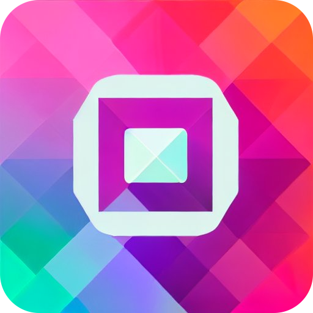
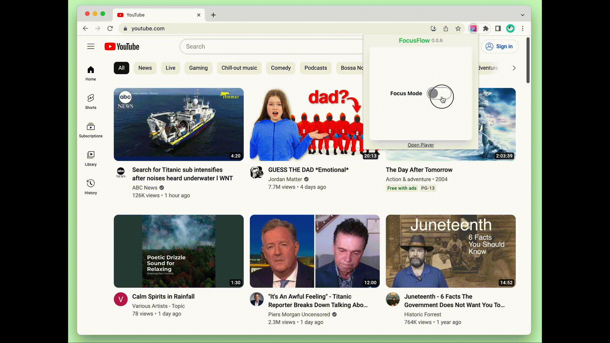
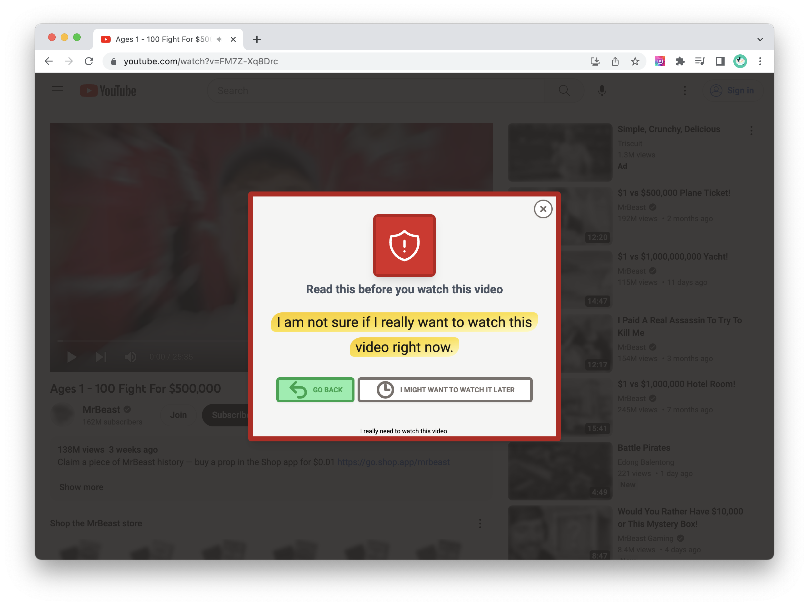

# Blur-Not-Block (Chrome Extension)

Let's make the Internet less interesting so that we can focus on what matters. A simple browser extension that helps you defer your urge to open distracting websites such as YouTube.

  

## Make Internet Less Interesting

Blur not Block! A Chrome extension that makes the Internet less interesting by blurring images on your favorite social media website such as YouTube and let you defer content consumption for later. So that  we can focus on what matters most.

  

The extension will automatically blur all the images on targeted pages and less colorful. So that web site such as YouTube is less interesting visually distracting during work and study hours. Once the image is blurred and turned into gray, you'll be surprised how much less interesting and less distractive websites are and how easy it is to nudge your attention back to what matters the most!

It also help you deffer the media consumption by adding to watch playlist. So that you can come back to the contents during breaks.

Contents in the list for later consumption can be watched on the built-in player. The player is designed to be minimal and distraction-free. It also has a built-in timer to help you manage your time.
